# Brain Tumor MRI Classifier

A deep learning system that classifies brain MRI scans into four categories
— **glioma**, **meningioma**, **pituitary tumor**, or **no tumor** — using a
fine-tuned **VGG16** convolutional neural network. The trained model is
deployed as a web application with a Flask backend, allowing users to
upload an MRI scan and receive an instant classification with confidence
scores.

---

## Table of Contents

- [Overview](#overview)
- [Dataset](#dataset)
- [Model Architecture](#model-architecture)
- [Training Details](#training-details)
- [Evaluation](#evaluation)
- [Web Application](#web-application)
- [Project Structure](#project-structure)
- [Setup & Usage](#setup--usage)
- [Model File](#model-file)
- [Tech Stack](#tech-stack)
- [Limitations & Future Work](#limitations--future-work)
- [Disclaimer](#disclaimer)

---

## Overview

Brain tumors are typically diagnosed by manually examining MRI scans, a
process that is time-consuming and requires specialist expertise. This
project explores whether a convolutional neural network, fine-tuned on a
labeled MRI dataset, can automate the initial classification step —
flagging the tumor type or confirming its absence — to support (not
replace) clinical decision-making.

The full experimentation, training, and evaluation pipeline is documented
in [`brain_tumour_detection_using_deep_learning.ipynb`](./brain_tumour_detection_using_deep_learning.ipynb).

## Pipeline

```mermaid
flowchart TD
    A[MRI dataset<br/>4 classes, train/test split] --> B[Preprocessing<br/>Resize 128x128, normalize]
    B --> C[Augmentation<br/>Random brightness & contrast]
    C --> D[VGG16 + classifier head<br/>Frozen base, fine-tuned top layers]
    D --> E[Training<br/>Adam optimizer, 5 epochs]
    E --> F[Evaluation<br/>Accuracy, confusion matrix, ROC]
    F --> G[model.h5 exported]
    G --> H[Flask /predict endpoint]
    H --> I[Same preprocessing applied<br/>to uploaded image]
    I --> J[model.predict&#40;&#41;]
    J --> K[Result shown in browser<br/>class + confidence]
```



## Dataset

- MRI scans organized into `Training/` and `Testing/` directories, each
  containing four class subfolders: `glioma`, `meningioma`, `pituitary`,
  `notumor`.
- Image paths and labels were collected via directory listing and shuffled
  prior to training to avoid ordering bias.
- **Preprocessing**: each image resized to 128×128, pixel values normalized
  to the [0, 1] range.
- **Augmentation**: random brightness and contrast jittering applied during
  training to improve generalization.

## Model Architecture

Transfer learning was used with **VGG16** (pretrained on ImageNet) as the
convolutional base:

| Layer | Details |
|---|---|
| Base | VGG16, `include_top=False`, ImageNet weights, input 128×128×3 |
| Freezing | All base layers frozen except the last 3 (fine-tuned) |
| Flatten | Flattens base model output |
| Dropout | 0.3 |
| Dense | 128 units, ReLU |
| Dropout | 0.2 |
| Output | Dense, 4 units, Softmax |

Freezing most of the base model preserves the general image features VGG16
learned from ImageNet, while unfreezing the last few convolutional layers
lets the network adapt to MRI-specific patterns — a balance between
leveraging pretrained knowledge and domain fine-tuning.

## Training Details

- **Optimizer**: Adam, learning rate = 0.0001 (kept low to avoid disrupting
  pretrained weights)
- **Loss**: Sparse categorical crossentropy (integer-encoded labels)
- **Metric**: Sparse categorical accuracy
- **Regularization**: Two dropout layers + data augmentation to reduce
  overfitting
- **Batch size**: 20
- Training/loss curves are plotted in the notebook to track convergence
  across epochs

## Evaluation

Model performance was assessed beyond raw accuracy:

- **Classification report** — precision, recall, and F1-score per class
- **Confusion matrix** — to identify which tumor types were most often
  confused with one another
- **ROC curves and AUC** (one-vs-rest) — per-class discrimination ability

These plots and metrics are available in full in the notebook.

## Web Application

The trained model (`model.h5`) is served through a Flask backend:

- `/predict` endpoint accepts an uploaded image, applies the same
  preprocessing pipeline used during training (resize to 128×128,
  normalize by 255), and returns the predicted class with confidence
  scores for all four classes.
- The frontend (HTML/CSS/JavaScript) provides drag-and-drop image upload,
  a live preview, and a confidence breakdown for each class.

## Project Structure

```
brain-tumor-mri-classifier/
├── app.py                                              # Flask backend
├── brain_tumour_detection_using_deep_learning.ipynb    # training & evaluation notebook
├── requirements.txt                                     # Python dependencies
├── templates/
│   └── index.html                                       # Web UI
└── static/
    ├── css/style.css
    └── js/script.js


